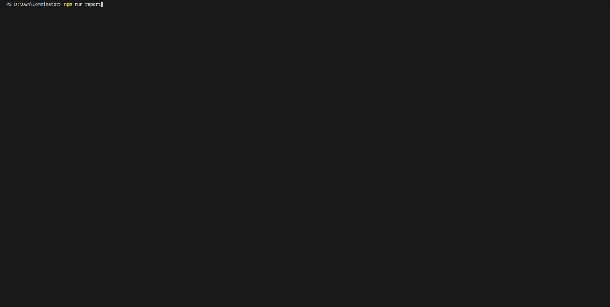

# 🤖 Comminator (代码提交终结者)

> **"I'll be back... with your Daily Report."**
>
> _Summarize commits. Terminate wasted time._

  

## 📖 简介 (Intro)

你是否在周五下午面对空白的日报文档陷入沉思？
你是否明明写了一堆代码，却在老板问你“这周干了啥”时大脑宕机？

**Comminator** 是你的救星。它是一个基于 TypeScript 开发的 CLI 工具，像 T-800 终结者一样扫描你的硬盘，提取你散落在各个仓库的 Git 提交记录，并调用 AI（如 Ollama/Qwen）将其“炼成”一份专业、精炼的日报或周报。

## 📺 演示 (Demo)



## ✨ 核心能力 (Features)

- **🕵️‍♂️ 深度侦察**：递归扫描指定工作区（Workspace）下的所有 Git 仓库，无论藏多深都能挖出来。
- **🎯 精准锁定**：根据配置的 `author` 过滤提交记录，只统计你的工作，不冒领他人的功劳。
- **🧠 私有化 AI**：支持自定义 AI API 地址（如本地 Ollama 或私有部署模型），不再依赖公网 Key，**数据更安全**。
- **⚡ 极速交互**：基于 `@clack/prompts` 的丝滑 CLI 界面，支持交互式选择“今天”或“本周”。
- **🛡️ 智能过滤**：自动剔除 Merge Request 等无意义的合并记录。

## 🛠️ 环境要求 (Prerequisites)

- **Node.js**: v18 或更高版本（需要原生 fetch API 支持）。
- **Git**: 已安装并配置好。
- **AI 模型服务**:
  - 推荐使用 [Ollama](https://ollama.com/) 本地运行。
  - 当前默认适配的模型为 `qwen3:8b`（通义千问），请确保你的 Ollama 已拉取此模型 (`ollama pull qwen3:8b`)，或在代码中修改为你喜欢的模型。

## 🚀 快速开始 (Quick Start)

### 1. 克隆项目

```bash
git clone <https://github.com/your-username/comminator.git>
cd comminator
```

### 2. 安装依赖

我们使用 `tsx` 引擎，速度快得像液态金属。

```bash
npm install
```

### 3. 配置环境变量 (Configuration)

**这是最重要的一步！** 为了保护隐私，我们使用 `.env` 文件管理配置。

请在项目根目录下创建一个 `.env` 文件（或复制示例文件）：

```bash
cp .env.example .env
```

然后编辑 `.env` 文件，填入你的真实信息：

```ini

# 1. 你的代码工作区根目录（注意：Windows 下路径分隔符建议用 / 或 \\\\）
workspace=D:/Own/Work

# 2. 你的 Git 用户名（用于过滤属于你的提交）
author=YourGitName

# 3. AI 接口地址（支持 Ollama 或其他兼容 OpenAI 格式的接口）
# 本地 Ollama 默认地址为
AI_API_URL=<http://127.0.0.1:11434/api/generate>

# 4. AI 模型名称
AI_MODEL=qwen3:8b
```

### 4. 启动终结者

一切就绪，运行以下命令：

```bash
npm run report
```

或者使用 `npx` 直接运行：

```bash
npx tsx ./src/index.ts
```

## 🎮 使用指南

1. 运行工具后，终端会显示交互式菜单。
2. 选择汇报范围：
   - 📅 **今天 (Today)**：适合每日站会或下班前的日报。
   - 📅 **本周 (This Week)**：适合周五的周报总结（自动从本周一算起）。
3. 工具会自动扫描仓库、提取日志、发送给 AI。
4. 等待几秒钟（取决于你的显卡算力），生成的日报将直接打印在屏幕上。

## ⚠️ 常见问题 (Troubleshooting)

**Q: 报错 `Error: 请在 .env 文件中正确配置...`？**
A: 你忘记创建 `.env` 文件了，或者文件里的变量名写错了。请确保文件中包含 `workspace`, `author`, `AI_API_URL`,`AI_MODEL`。

**Q: AI 生成失败或超时？**
A: 请检查 `.env` 中的 `AI_API_URL` 是否能通。如果是本地 Ollama，请确保 `ollama serve` 正在后台运行。

**Q: 想要换一个 AI 模型？**
A: 目前模型名称默认为 `qwen3:8b`。你可以修改 `.env` 中的 `AI_MODEL` 字段来更换模型。

## 🤝 贡献 (Contributing)

欢迎提交 Issue 或 PR！如果你想增加对 DeepSeek、ChatGPT 或其他模型的支持，请随时动手。

## 📜 许可证 (License)

MIT License.
